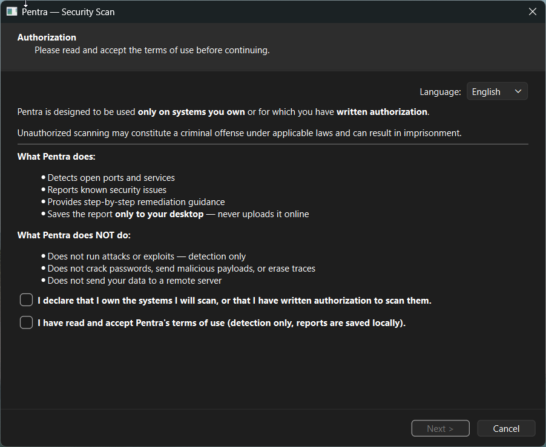
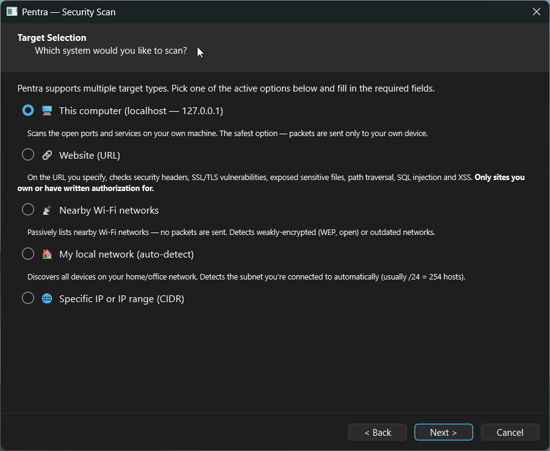
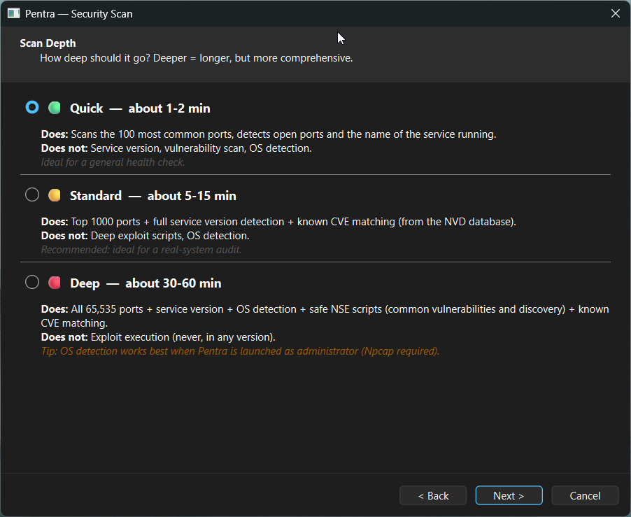
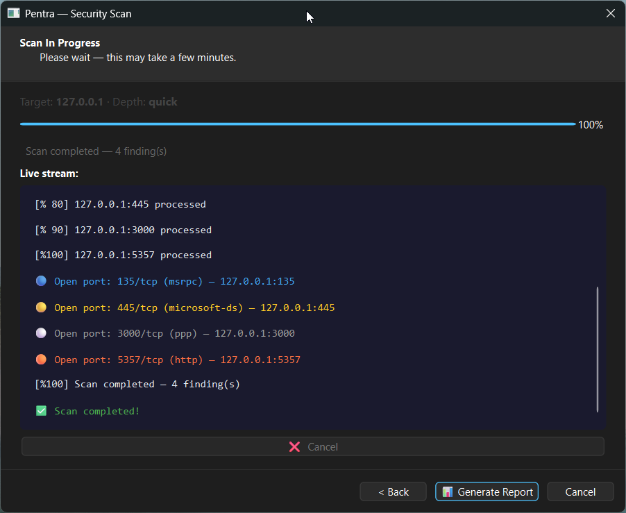
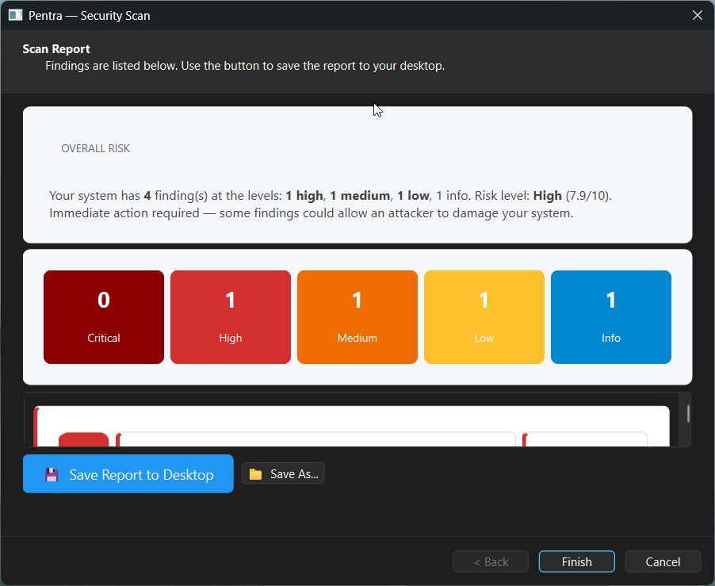
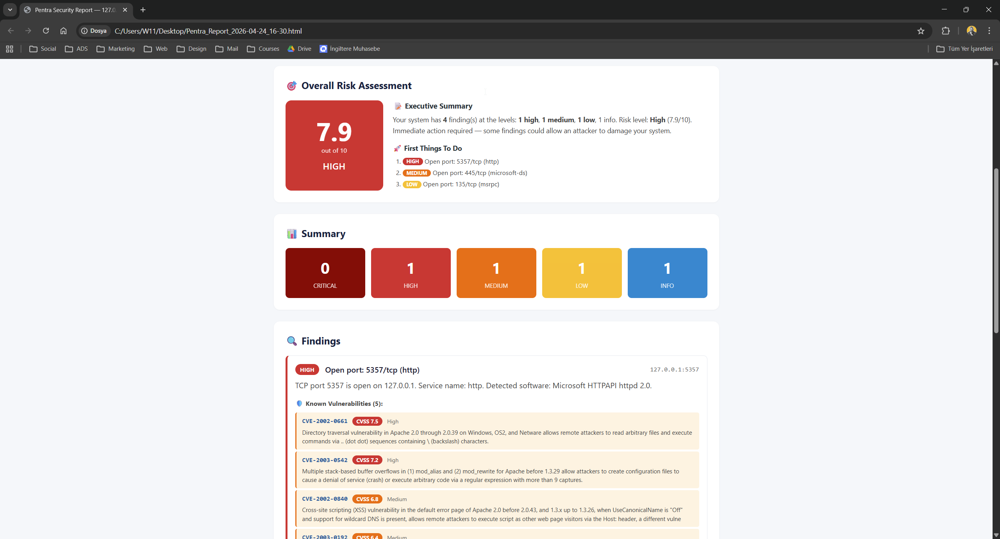

<p align="center">
  
</p>

<p align="center">
  <b>A wizard-based vulnerability assessment tool for Windows.</b><br>
  Built for beginners — Level 2 non-destructive probing, beginner-friendly UI, all reports stay local.
</p>

<p align="center">
  <a href="LICENSE"></a>
  
  
  <a href="https://github.com/ozzdemirbrk/pentra/actions/workflows/ci.yml"></a>
  <a href="https://github.com/ozzdemirbrk/pentra/releases/latest"></a>
</p>

<p align="center">
  <a href="#why-pentra">Why Pentra</a> ·
  <a href="#what-pentra-does--does-not-do">What It Does</a> ·
  <a href="#%EF%B8%8F-legal-disclaimer">Disclaimer</a> ·
  <a href="#installation">Install</a> ·
  <a href="#usage">Usage</a> ·
  <a href="#features">Features</a> ·
  <a href="#roadmap-v2">Roadmap</a> ·
  <a href="#credits">Credits</a>
</p>

---

## Why Pentra?

Most vulnerability scanners (Nessus, OpenVAS, Qualys) are built for professional
security teams. They are powerful — and intimidating for people who just want to
know whether their own home network, personal website, or development machine
has obvious security holes.

**Pentra is a vulnerability scanner for the rest of us.** It walks you through
the scan in five simple steps, explains every option in plain language, and
saves a detailed report to your desktop. No cloud. No sign-up. No confusing
command-line flags.

**Who it's for:**
- Individual developers who want to audit their own web apps
- IT-aware home users checking their router, NAS, or home lab
- Students and newcomers learning security concepts in a safe way
- Small business owners wanting a baseline audit of their own systems

**Who it's not for:**
- Authorized corporate penetration testers (use Nessus/Qualys/Burp)
- Red teams (Pentra has zero exploitation capabilities by design)
- Anyone wanting to scan systems they don't own

---

## What Pentra Does / Does Not Do

Pentra sits firmly at **Level 2: non-destructive probing** on the assessment
scale.

### ✅ What it does

- **Port scanning** — TCP connect scans via Nmap; common ports, top 1000, or all 65,535
- **Service version detection** — Identifies running software for CVE matching
- **CVE lookup** — Queries the NVD database to match services with known vulnerabilities
- **Non-destructive vulnerability probing** — Single-shot tests for common issues:
  - Missing security headers (HSTS, CSP, X-Frame-Options, Referrer-Policy, ...)
  - SSL/TLS weaknesses (old protocols, expired certificates)
  - Exposed sensitive files (`.env`, `.git/config`, SQL dumps, `wp-config.bak`, `phpinfo.php`, ...)
  - SQL injection (error-based)
  - Reflected XSS (with echo-fallback false-positive detection)
  - Path traversal
  - Default credentials on MySQL, PostgreSQL, SSH, Redis, MongoDB, Elasticsearch (max 3 attempts, never brute force)
- **Wi-Fi passive listing** — Detects encryption type (Open / WEP / WPA / WPA2 / WPA3) without sending packets
- **Local network discovery** — Auto-detects your `/24` subnet and discovers active hosts
- **Multi-language UI & reports** — English (default) and Turkish, switchable on the fly
- **Risk scoring** — 0-10 score with an executive summary and top priority actions
- **Scan history & diff** — Compares each scan with the previous one on the same target
- **Step-by-step remediation guides** — 39 detailed guides with Nginx / Apache / IIS / Cloudflare variants

### ❌ What it explicitly does not do

- **No exploits, no shell spawning, no remote code execution**
- **No password brute forcing** beyond 3 default credential attempts
- **No data exfiltration** (no DB dumps, no file downloads)
- **No persistence, no lateral movement, no evasion**
- **No MITM, no ARP/DNS spoofing, no deauthentication attacks**
- **No cloud uploads** — reports are saved only to your desktop
- **No telemetry, no user tracking**

Pull requests that introduce any of the above will be rejected in code review.

---

## ⚠️ Legal Disclaimer

> **Run Pentra ONLY against systems you own or have explicit written authorization to test.**

Unauthorized scanning of networks, websites, or devices is a criminal offense
in most jurisdictions, including but not limited to:

- **United States:** Computer Fraud and Abuse Act (CFAA), 18 U.S.C. § 1030
- **European Union:** Directive 2013/40/EU on attacks against information systems
- **United Kingdom:** Computer Misuse Act 1990
- **Turkey:** Türk Ceza Kanunu (TCK) Articles 243, 244, 245
- **Canada:** Criminal Code § 342.1
- **Australia:** Cybercrime Act 2001

Penalties can include imprisonment. **You are solely responsible** for ensuring
you have permission to scan any target. The Pentra authors, contributors, and
maintainers **accept no liability** for misuse of this software. Pentra is
provided "as is", without warranty of any kind — see the [LICENSE](LICENSE)
file for full terms.

The first screen of Pentra requires you to confirm authorization. This is not
a formality: it is a legal and ethical contract between you and the tool.

---

## Installation

### Option 1 — Pre-built Windows executable (recommended)

1. Go to the [latest release](https://github.com/ozzdemirbrk/pentra/releases/latest).
2. Download `Pentra.exe`.
3. Double-click to run. No installation needed — it's a portable executable.

> **First launch:** Windows SmartScreen may display "Windows protected your PC"
> because Pentra is not yet code-signed. Click **More info → Run anyway**.
> This warning will go away once we add code signing in a later release.

### Option 2 — From source (for contributors or other platforms)

```bash
git clone https://github.com/ozzdemirbrk/pentra.git
cd pentra

# Set up a Python 3.11+ virtual environment
python -m venv .venv
.venv\Scripts\activate          # Windows
# source .venv/bin/activate     # Linux/macOS (experimental)

# Install dependencies
pip install -r requirements.txt -r requirements-dev.txt

# Run
python -m pentra
```

### Prerequisites — **Nmap is required**

Pentra drives [Nmap](https://nmap.org/download.html) for port scanning.
**You must install Nmap separately** before Pentra can scan ports.

- **Windows:** Download and run the installer from <https://nmap.org/download.html>.
  On install, keep the default options (which include Npcap — required for
  some scan types).
- **Linux:** `sudo apt install nmap` or equivalent for your distribution.
- **macOS:** `brew install nmap`.

If Pentra can't find Nmap, you'll see a clear error message on the scan
progress screen.

### Optional — NVD API key for faster CVE lookups

The National Vulnerability Database API is **public and free**, but anonymous
use is rate-limited (~5 requests per 30 seconds). For heavier use, get a free
API key at <https://nvd.nist.gov/developers/request-an-api-key>.

Pentra reads the key from a `.env` file in the project root:

```
NVD_API_KEY=your-key-here
```

The `.env` file is already in `.gitignore` and is never committed.

---

## Usage

Pentra is a five-screen wizard. The typical flow takes 2-15 minutes depending
on the depth you choose.

### 1. Authorization



Confirm that you own — or are authorized to scan — the target. Pick your
language (English / Türkçe) in the top right. Your selection is remembered
across launches.

### 2. Target Selection



Pick what you want to scan:

- **This computer (localhost)** — Safest, scans `127.0.0.1`.
- **Website (URL)** — Runs the web probes against a site you own.
- **Nearby Wi-Fi networks** — Passive listing only.
- **My local network** — Auto-detects your `/24` subnet (e.g. `192.168.1.0/24`).
- **Specific IP or CIDR range** — Manual entry for power users.

External (non-RFC1918) targets require an additional ownership confirmation.

### 3. Scan Depth



Three depths, each clearly labeled:

| Depth | Duration | What it does |
|---|---|---|
| 🟢 **Quick** | ~1-2 min | Top 100 ports + service name detection |
| 🟡 **Standard** | ~5-15 min | Top 1000 ports + full service version + NVD CVE matching |
| 🔴 **Deep** | ~30-60 min | All 65,535 ports + service version + OS detection + safe NSE scripts |

### 4. Scan Progress



Live stream of what Pentra is doing — progress bar, current step, and findings
as they're discovered. You can cancel at any time.

### 5. Report



Overall risk score, severity breakdown, and each finding with a suggested fix.
Click **Save Report to Desktop** to export a standalone HTML file:



The HTML report includes detailed remediation guides with Nginx / Apache /
IIS / Cloudflare snippets for each finding.

---

## Features

- ✅ **Five-screen wizard** — no command line, no configuration files
- ✅ **Bilingual** — English and Turkish, fully translated including 39 detailed remediation guides
- ✅ **Local-first** — reports saved to your desktop, nothing uploaded
- ✅ **Offline-friendly** — works without internet except for CVE lookups (graceful fallback when offline)
- ✅ **Rate-limited** — won't accidentally DoS your own network
- ✅ **Audit log** — every action recorded in a tamper-evident chained log
- ✅ **Scope validation** — RFC1918 enforcement, DNS deny lists, authorization tokens (HMAC-SHA256)
- ✅ **Scan history** — SQLite database of previous scans per target
- ✅ **Diff reports** — see what changed since last scan (new findings, resolved findings, risk delta)
- ✅ **Update notifications** — checks GitHub Releases on startup, silent if offline

---

## How Pentra Compares

| | Pentra | Nessus / Qualys | OpenVAS |
|---|---|---|---|
| **Target audience** | Individuals, SMBs | Enterprise security teams | Prosumer, enterprise |
| **Interface** | Wizard (5 screens) | Web UI, complex | Web UI, moderate |
| **Setup time** | < 1 minute | Licensing + server | Significant |
| **Cost** | Free, open-source | Commercial (thousands of USD/yr) | Free, open-source |
| **Exploit execution** | Never | Optional modules | Optional modules |
| **Local reports only** | ✅ Yes | ❌ Stored on server | ❌ Stored on server |
| **Number of checks** | ~50 categories | Thousands | Hundreds |

Pentra is not trying to replace enterprise scanners. It's trying to make a
**beginner-friendly vulnerability scanner** that fits the gap between "I have
no idea whether my server is safe" and "I need to set up a full scanning
infrastructure."

---

## Roadmap (v2)

Pentra v2 plans include CORS misconfiguration checks, DNS/email security
(SPF/DMARC/DKIM), blind SQL injection, technology fingerprinting,
subdomain enumeration, and more. All planned additions stay within the
Level 2 non-destructive probing manifesto.

**See [ROADMAP.md](ROADMAP.md)** for the complete list, including what will
never be added (and why).

---

## Security

Found a security vulnerability in Pentra itself? Please **do not open a public
issue**. See [SECURITY.md](SECURITY.md) for the responsible disclosure process.

Preferred channels:
- **Email:** [hello@burakozdemir.online](mailto:hello@burakozdemir.online)
- **GitHub:** private Security Advisory ("Report a vulnerability" button)

---

## Contributing

Pull requests are welcome! Before submitting:

1. **Open an issue first** for larger changes so we can align on the approach.
2. Make sure your change stays within the [Level 2 manifesto](ROADMAP.md#-never-to-be-added-manifesto-violations) — no exploits, no active attacks, no DoS, no credential theft.
3. Run the tests locally: `pytest`.
4. Keep the code style consistent: `ruff check` and `black --check`.

Small fixes (typos, doc clarifications, minor bugs) can go straight to a PR
without an issue.

---

## Credits

Pentra stands on the shoulders of these excellent open-source projects:

- **[Nmap](https://nmap.org/)** by Gordon "Fyodor" Lyon — the core of the port/service scanner
- **[NVD](https://nvd.nist.gov/)** — National Vulnerability Database for CVE data
- **[PySide6](https://doc.qt.io/qtforpython/)** — the Qt for Python bindings that power the UI
- **[Jinja2](https://jinja.palletsprojects.com/)** — the HTML report templating engine
- **[python-nmap](https://xael.org/pages/python-nmap-en.html)** — Python wrapper around Nmap
- **[scapy](https://scapy.net/)** — packet manipulation library
- **[paramiko](https://www.paramiko.org/)** — SSH protocol library
- **[requests](https://requests.readthedocs.io/)** — HTTP library
- **[packaging](https://packaging.pypa.io/)** — version parsing
- **[Pillow](https://python-pillow.org/)** — image processing for icon generation
- **[PyInstaller](https://pyinstaller.org/)** — executable packaging

Thank you to the security researchers and writers whose work informed
Pentra's remediation guides, including the OWASP, MDN, and CISA teams.

---

## License

Pentra is released under the [MIT License](LICENSE).

Copyright © 2026 Burak Özdemir.
